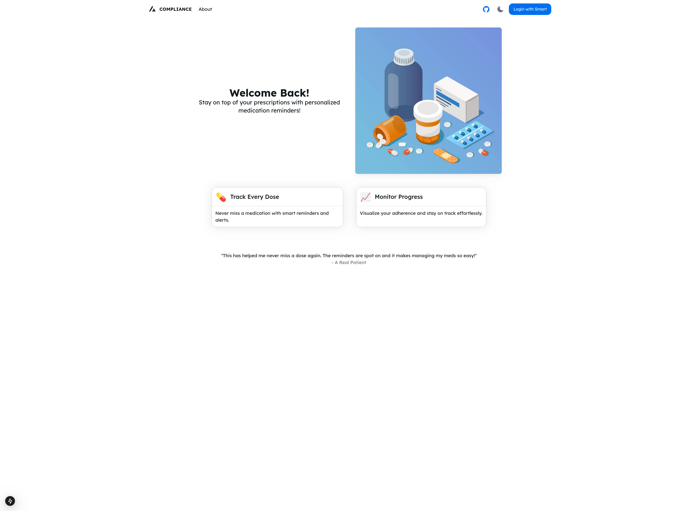
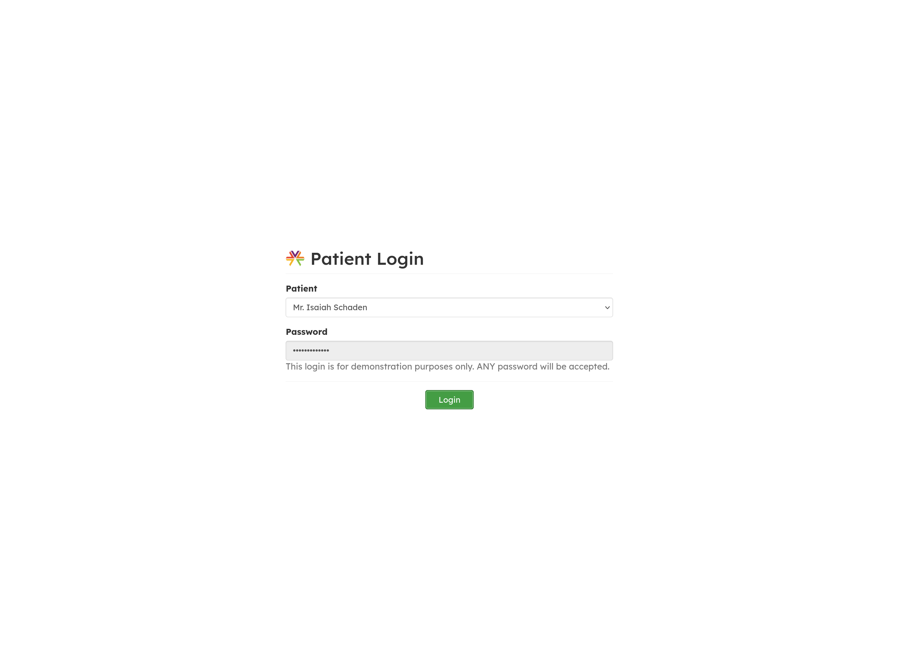
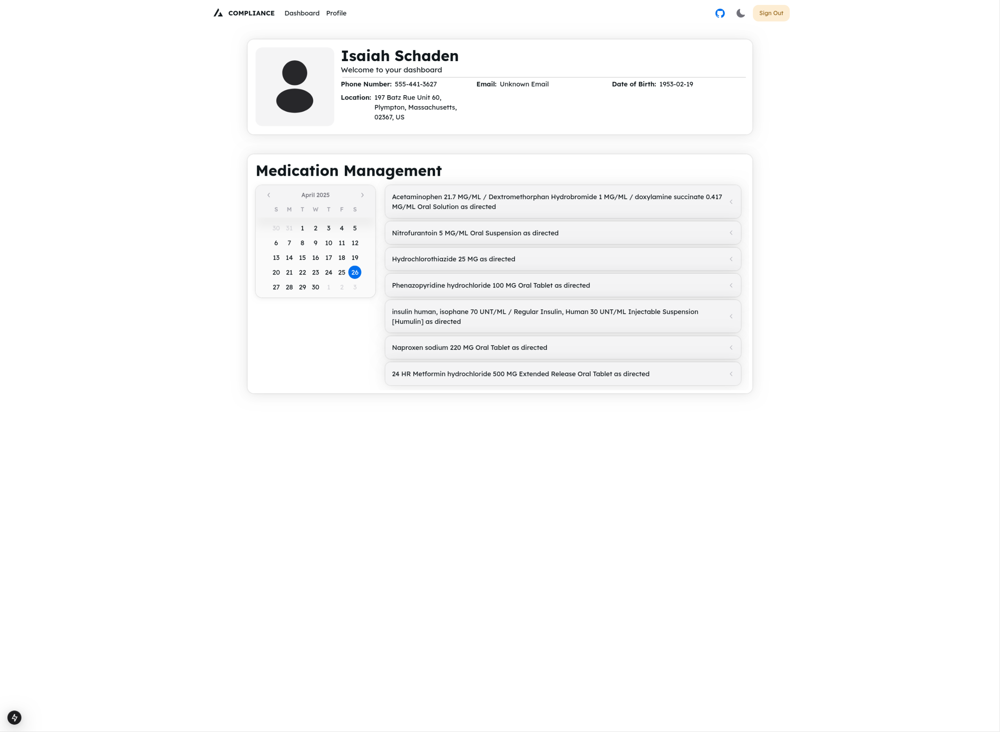
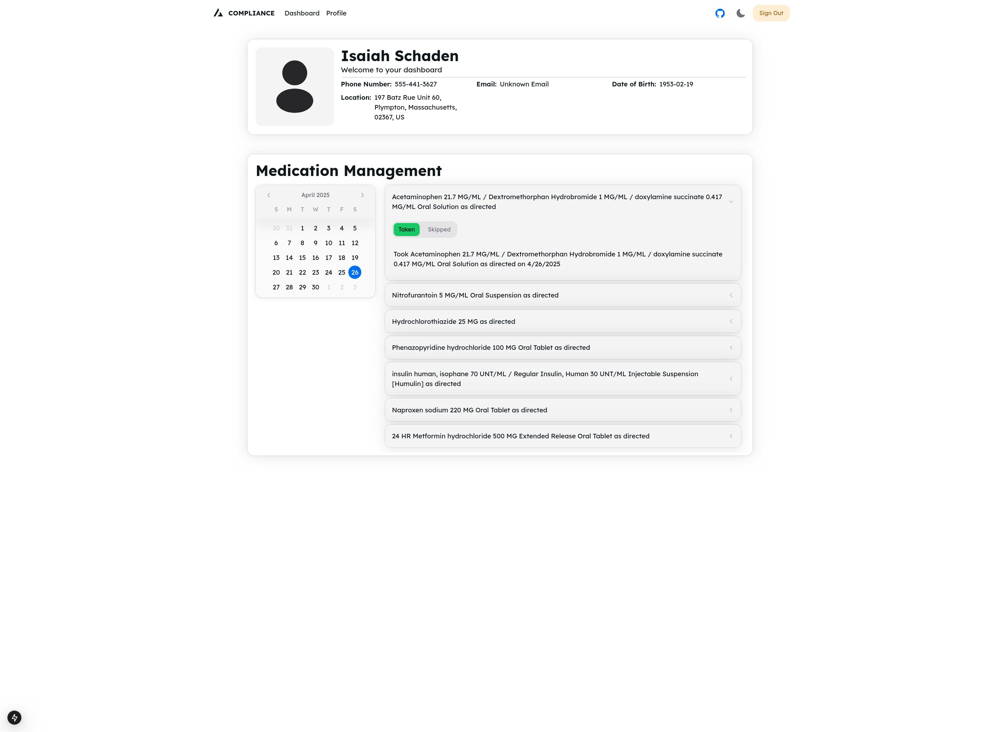
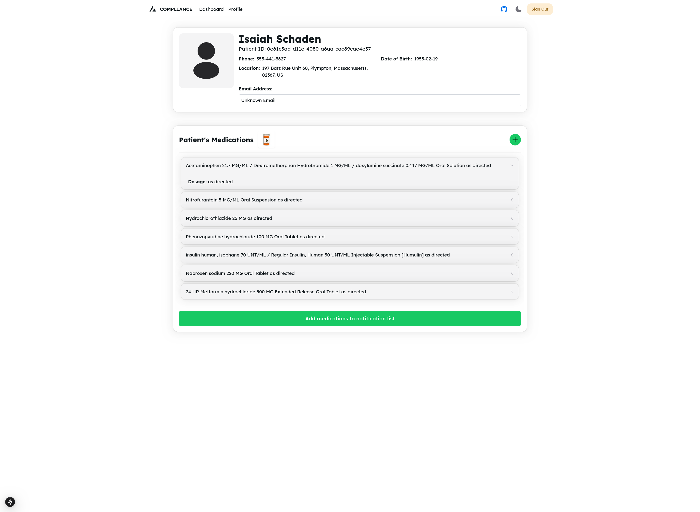
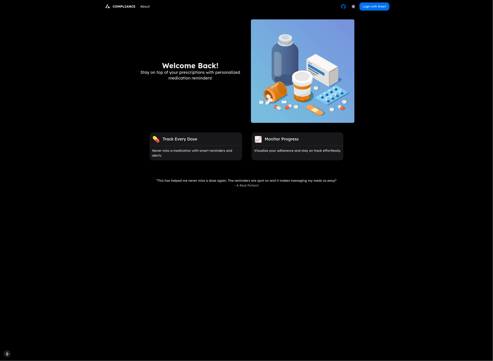
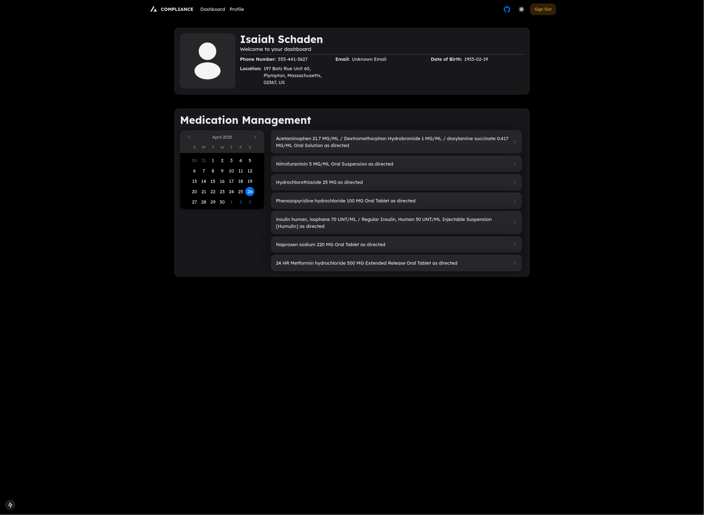
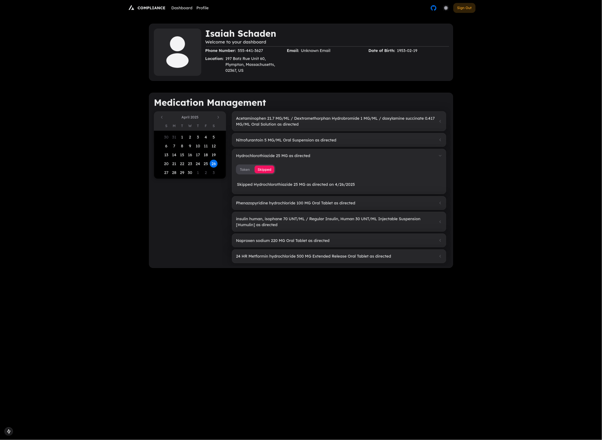
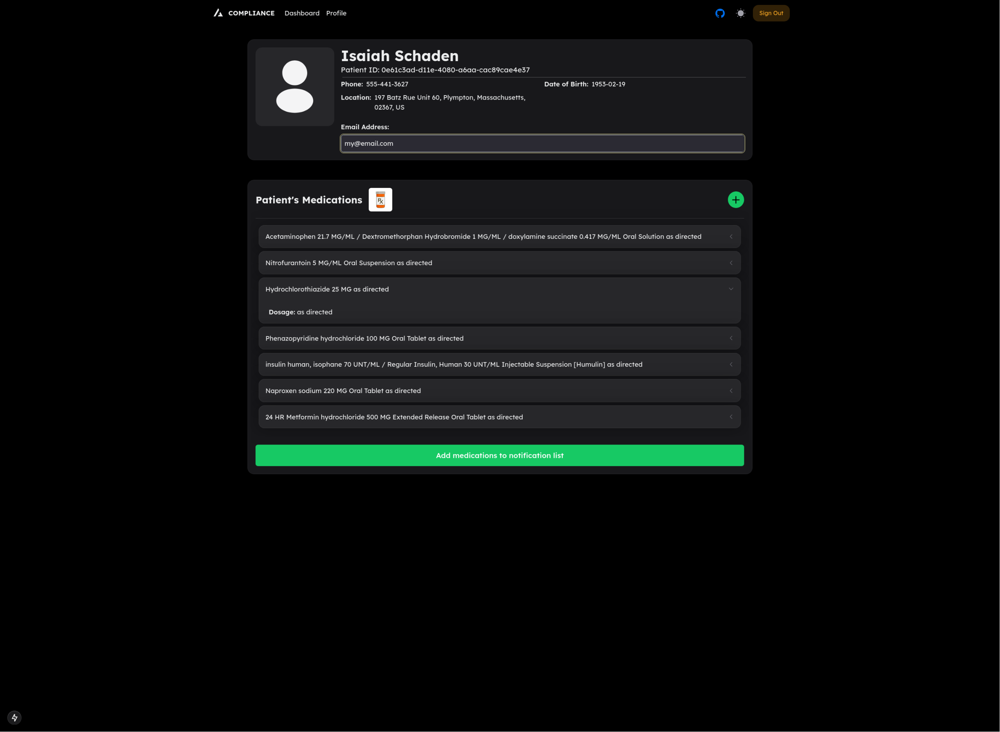
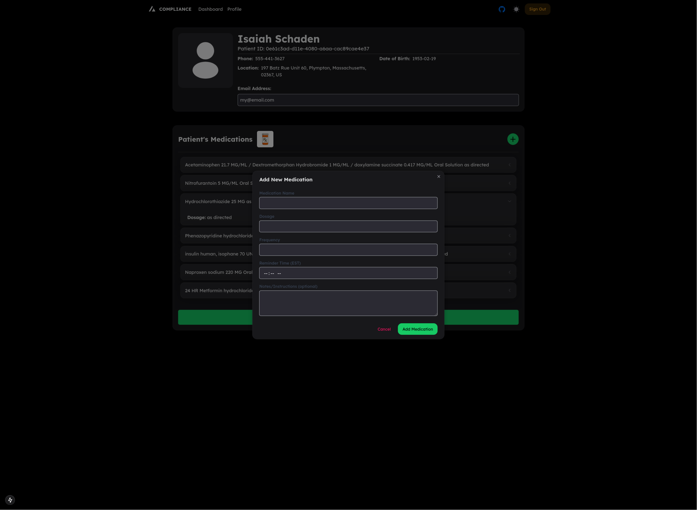

## 💊 Medical Adherence System
A full-stack web application designed to help patients stay on track with their prescribed medications by providing reminders and tracking adherence.

### 🔧 Features
- User registration & authentication
- Medication scheduling with automated reminders
- Adherence tracking dashboard
- Alerts for missed doses

### 👥 Team Project
This project was developed collaboratively as part of a health-tech initiative. My contributions included:
- Building RESTful APIs using JavaScript and Next.js
- Designing the frontend UI with React and Tailwind CSS
- Implementing secure user authentication (JWT-based)

### 🛠 Technologies Used
- React
- Next.js
- Tailwind CSS
- JavaScript
- FHIR
- TypeScript

### 🚀 Screenshots:

 
 
 
 
 
 
 
 
 

